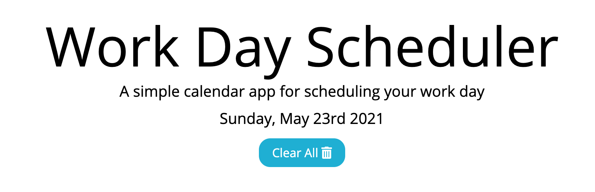
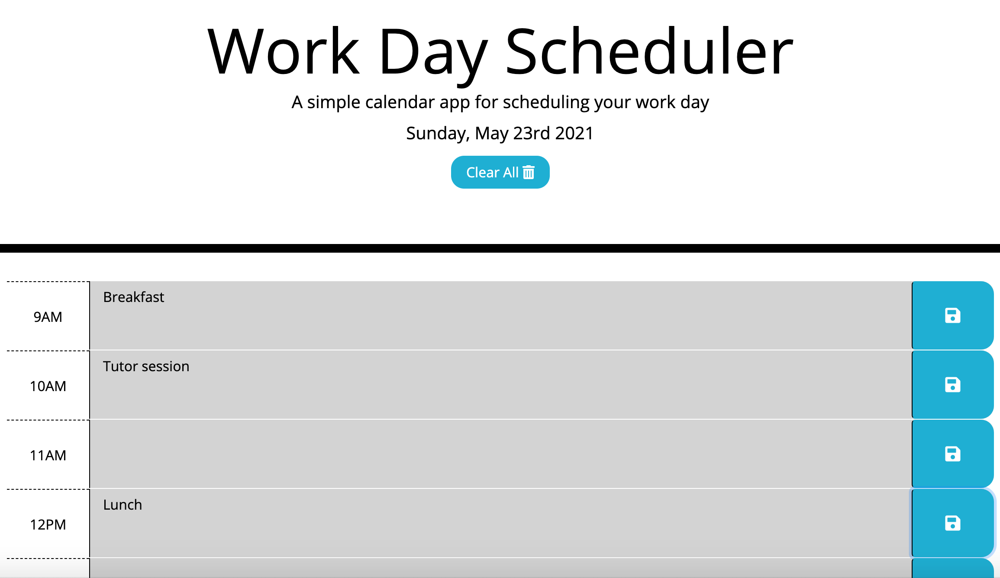
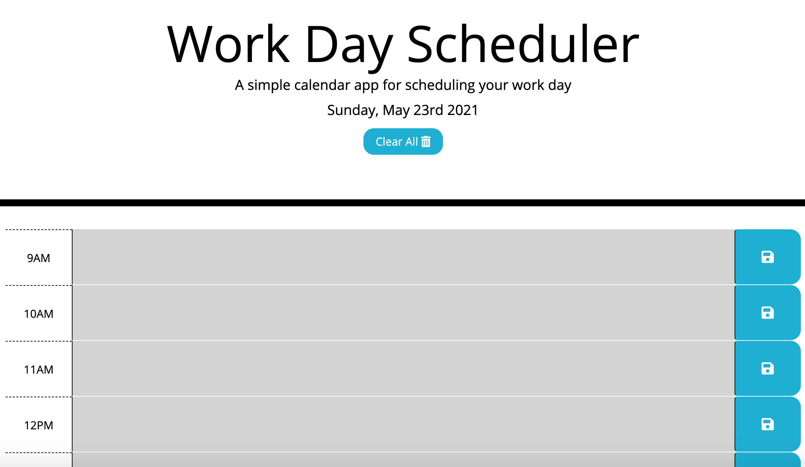

# Simple Work Day Scheduler

## For the user who would like to:
- check and edit schedule daily
- save events for each hour of the day to manage the time effectively

## How it works:
1. Click the timeblock next to the time to enter the event.
2. Click the save button for the timeblock to save the event in local storage
3. Click `Clear All` to delete all recorded events in local storage

## Features:
1. The current day is displayed at the top of the calendar.



2. Each timeblock is color coded to indicate whether it is in the past, present, or future
```javascript
if (blockTime < currentTime) {
    $(this).addClass("past");
    $(this).removeClass("present");
    $(this).removeClass("future");
}
else if (blockTime === currentTime) {
    $(this).removeClass("past");
    $(this).addClass("present");
    $(this).removeClass("future");
}
else {
    $(this).removeClass("past");
    $(this).removeClass("present");
    $(this).addClass("future");
}
```


3. When the user wants to clear the calendar at the end of the day or next morning:
- the user can click `Clear All` then refresh the page to delete all recorded events.

### Before:


### After:


### Example:
```javascript
$(".clearBtn").click (function() {
    localStorage.clear();
})
```